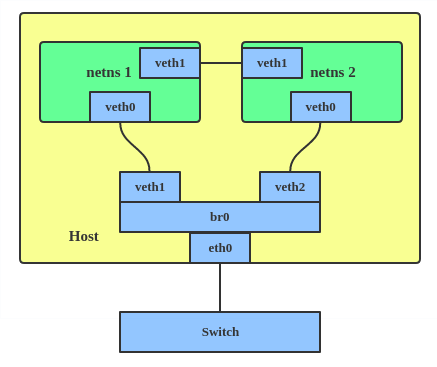
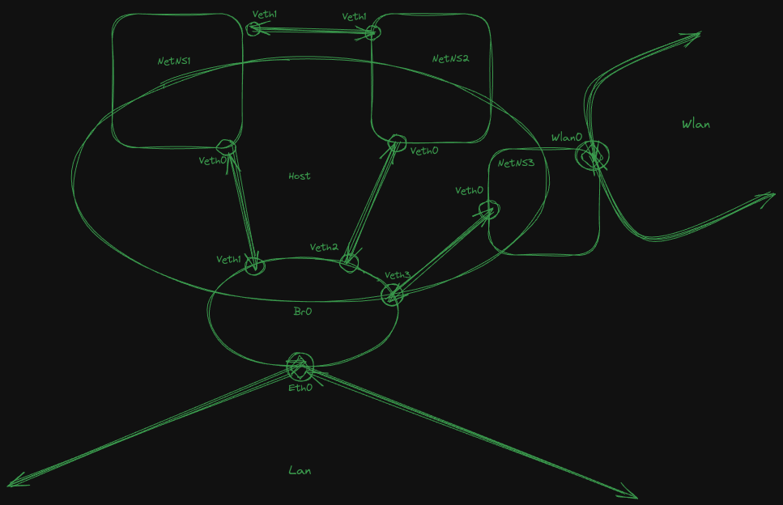

```text
# __     _______ _____ _   _
# \ \   / / ____|_   _| | | |
#  \ \ / /|  _|   | | | |_| |
#   \ V / | |___  | | |  _  |
#    \_/  |_____| |_| |_| |_|
#
```

Virtual Ethernet Devices
------------------------

Not to be confused with VLANS, which although concerns a type of networking, is something completely different
altogether.

A virtual ethernet device is self explanatory, it is a completely abstract and virtualized device that is used
to define it own internal network namespace. The networks created by veth devices are internal, and do not
communicated directly with external addresses or devices. Veths are different from the confusingly names
"dummy" interface, because dummy interfaces are used to connect two external networks and do not generate
their own network namespace.

Please note, Veth devices are created in pairs. 

### Jargon

* NameSpace: Is a completely independent copy of the system networking stack. (without preconfiguration)

### Pretty Pictures





### Creating network namespaces and virtual ethernet interfaces

Creation and management of both network namespaces and virtual ethernet interfaces is managed by iproute2, and
will involve commands that you may not yet be familiar with. Network namespace management using the syntax `ip
netns <$COMMAND>`.

```bash
# First we create two network namespaces
ip netns add net1
ip netns add net2
# Here we show how you can create the two interfaces, one for each namespace, and
#   assign both of them to their corresponding namespaces all in with one command.
ip link add veth1 netns net1 type veth peer name veth2 netns net2
```

In order to view system namespaces, you will need to run the `ip netns list` command.

### Creating a network namespace, assign an IP, and assign a physical interface

So now we will take the above example more slowly and expand upon it in order to further explain how to
create, manage, and define namespaces and virtual ethernet devices. Just in case you didn't pick up on the
warning above, namespaces and virtual ethernet networking is not the same thing as virtual lans (called, vlans).
The two are completely different concepts. 

Lets create another namespace this time, we will call it "cheryl". Why we chose cheryl is completely
meaningless, it was just the first random name that came into mind.

```bash
ip netns add cheryl
```

Now that cheryl has been created, lets create a pair of virtual interface for her. Remember, virtual ethernet
interfaces have to be created in pairs, so there is no such thing as a solo performance here. This is because
the virtual ethernet network stack is designed with the intent of allowing two different namespaces with two
completely different subnets to communicate between each other. To do so, two interfaces are required in order
to communicate in the two different subnets. More about this can be found in 
[this article](https://developers.redhat.com/blog/2019/05/17/an-introduction-to-linux-virtual-interfaces-tunnels).

```bash
ip link add veth0 type veth peer name veth1
```

Now notice, if you run `ip link list`, you will be able to see both of your newly created virtual interfaces.
This is because you have not assigned those interfaces to their respective namespaces. Once you do so, they
will no longer be visible by executing `ip link list`. In order to view them, you will need to execute a
completely different command described below. So now, lets assign them to those namespaces.

```bash
ip link set veth1 netns cheryl
# AND stop here.
```

Notice how we only assigned one of our two interfaces, this is because if we assigned both interfaces to the
same namespace, the namespace would not be able to communicate with anything outside of it. Now, if your run
`ip link list`, here is what you should see.

```bash
1: lo: <LOOPBACK,UP,LOWER_UP> mtu 65536 qdisc noqueue state UNKNOWN mode DEFAULT group default qlen 1000
    link/loopback 00:00:00:00:00:00 brd 00:00:00:00:00:00
2: eth0: <BROADCAST,MULTICAST,UP,LOWER_UP> mtu 1500 qdisc fq_codel state UP mode DEFAULT group default qlen 1000
    link/ether 00:12:34:56:78:90 brd ff:ff:ff:ff:ff:ff
13: veth0@if12: <BROADCAST,MULTICAST> mtu 1500 qdisc noop state DOWN mode DEFAULT group default qlen 1000
    link/ether 11:22:33:44:55:66 brd ff:ff:ff:ff:ff:ff link-netns cheryl
```

OR if your old school and ran `ifconfig -a`, it will look like:

```bash
eth0: flags=4163<UP,BROADCAST,RUNNING,MULTICAST>  mtu 1500
        inet 000.000.000.000  netmask 255.255.255.255  broadcast 000.000.000.000
        inet6 XXXX::XXXX:XXXX:XXXX:XXXX  prefixlen 64  scopeid 0x20<link>
        ether 00:11:22:33:44:55  txqueuelen 1000  (Ethernet)
        RX packets 1832702  bytes 984399039 (938.7 MiB)
        RX errors 0  dropped 0  overruns 0  frame 0
        TX packets 1200054  bytes 180983482 (172.5 MiB)
        TX errors 0  dropped 0 overruns 0  carrier 0  collisions 0
        device interrupt 17  

lo: flags=73<UP,LOOPBACK,RUNNING>  mtu 65536
        inet 127.0.0.1  netmask 255.0.0.0
        inet6 ::1  prefixlen 128  scopeid 0x10<host>
        loop  txqueuelen 1000  (Local Loopback)
        RX packets 2735  bytes 381510 (372.5 KiB)
        RX errors 0  dropped 0  overruns 0  frame 0
        TX packets 2735  bytes 381510 (372.5 KiB)
        TX errors 0  dropped 0 overruns 0  carrier 0  collisions 0

veth0: flags=4098<BROADCAST,MULTICAST>  mtu 1500
        ether 66:77:88:99:00:11  txqueuelen 1000  (Ethernet)
        RX packets 0  bytes 0 (0.0 B)
        RX errors 0  dropped 0  overruns 0  frame 0
        TX packets 0  bytes 0 (0.0 B)
        TX errors 0  dropped 0 overruns 0  carrier 0  collisions 0
```

In order to show the network interfaces that are connected to the virtual namespace, you will need to enter
use `ip netns exec cheryl ip link list`. Which should give you:

```bash
1: lo: <LOOPBACK> mtu 65536 qdisc noop state DOWN mode DEFAULT group default qlen 1000
    link/loopback 00:00:00:00:00:00 brd 00:00:00:00:00:00
12: veth1@if13: <BROADCAST,MULTICAST> mtu 1500 qdisc noop state DOWN mode DEFAULT group default qlen 1000
    link/ether 66:99:11:22:33:44 brd ff:ff:ff:ff:ff:ff link-netnsid 0
```

There you go, the virtual ethernet interface is connected to the namespace. Now let's assign it an IP address.

```bash
ip netns exec cheryl ip addr add 10.1.1.1/24 dev veth1
ip netns exec cheryl ip link set dev veth1 up
```

If you wanted to add a physical device to a namespace, you can simply do so with `ip link set dev
<$YOUR_DEVICE> netns cheryl`, and with that you will have a physical device on the namespace as well.
